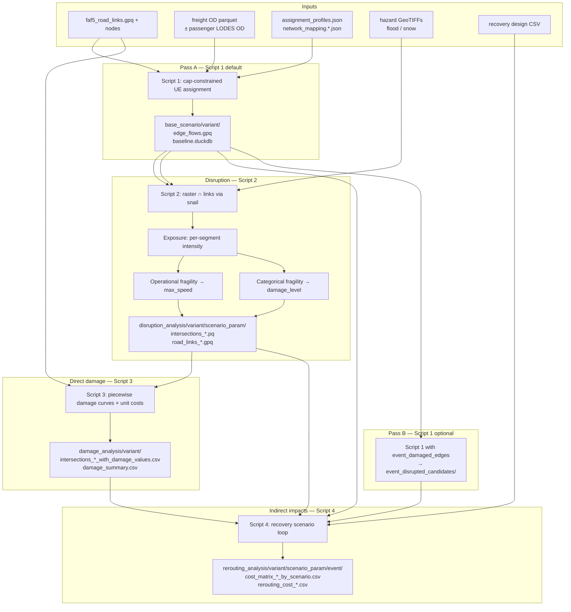

# ResiFlow pipeline (technical overview)

ResiFlow is a **four-script transport resilience workflow**: baseline network assignment → hazard exposure & operational disruption → direct asset damage → disrupted rerouting under recovery scenarios. It reads a data bundle from `config.json` (`paths.soge_clusters`) and writes under `<parent>/results/<variant>/`.

---

## High-level flow



**Typical CONUS run:** Pass A → Script 2 (× events) → export damaged edges → Script 3 → Pass B → Script 4 (× events). Testbed runs often skip Pass B and use a smaller candidate set.

---

## Script 1 — Baseline assignment (`road_revised.network_flow_model`)

**Purpose:** Solve **cap-constrained user equilibrium** on the road network before any hazard.

| Stage | What happens |
|-------|----------------|
| Load | FAF5 links, freight OD (`faf5_od_matrix.pq`), optional passenger OD; merge to combined demand (`Car21` flow column) |
| Normalize | `network_class` → `assignment_tier` via `network_mapping.faf5.json`; apply BPR-style capacity/speed profiles from `assignment_profiles.json` |
| Assign | Iterative all-or-nothing with capacity feedback until convergence (`RESIFLOW_MAX_FLOW_ITERATIONS=0`) or smoke cap |
| Persist | Per-link flows/speeds/capacities → `edge_flows.gpq`; path realization in DuckDB (`baseline.duckdb`) |

**Pass A (default):** full baseline for all links.  
**Pass B (CONUS):** re-run with `NIRD_EVENT_DAMAGED_EDGES_PATH` set and `NIRD_BASELINE_PATH_OUTPUT_MODE=event_candidates` — only ODs whose shortest paths cross damaged edges get re-solved; outputs `event_disrupted_candidates/<depth_event>/parts/`.

---

## Script 2 — Hazard disruption (`run_disruption`)

**Purpose:** Map hazard intensity onto links and compute **operational** disruption (speed caps) plus **categorical** damage states for recovery.

Dispatched by `RESIFLOW_HAZARD_TYPE`:

| Type | Arg 1 | Intensity in raster | Closure rule |
|------|-------|---------------------|--------------|
| `flood` (default) | `depth_key` (cm) | meters depth | quadratic speed penalty; ≥ threshold → `max_speed=0` |
| `snow` | `snow_key_mm` (mm) | mm snowfall | same functional form on snow depth |

**Per event, three transforms (kept separate by design):**

1. **Exposure** (`exposure/raster_line.py`): subset links to raster extent → clip to study area → **snail** line–raster intersection → segment intensities (`flood_depth_*` or `snow_depth_mm`).
2. **Categorical fragility** (`fragility/*_categorical.py`): intensity + road class → `damage_level_{surface,river}` (minor…severe).
3. **Operational fragility** (`fragility/*_operational.py`): link-level `max_speed` for Script 4 routing.
4. **Aggregate** to links; attach `hazard_type`, `intensity_primary`, legacy columns for Scripts 3/4.

**Outputs:**
```text
results/disruption_analysis/<variant>/<scenario_param>/
  intersections/intersections_<event>.pq
  links/road_links_<event>.gpq
```

---

## Script 3 — Direct damage (`3_damage_analysis.py`)

**Purpose:** Convert flooded/snow-affected **infrastructure segments** to **USD direct damage** using HAZUS-style piecewise curves (C1–C6 road classes) and unit-cost tables from Excel workbooks in the data bundle.

- Walks all `intersections_*.pq` under the results variant (hazard-agnostic discovery).
- Uses `flood_depth_surface` / `flood_depth_river` (snow is shimmed into `flood_depth_surface`).
- Filters to non-`no` damage levels; writes per-event CSVs + optional `damage_summary.csv` rollup (`3_postprocess_damage.py`).

**Output:** `damage_analysis/<variant>/intersections_<event>_with_damage_values.csv`

---

## Script 4 — Rerouting & recovery (`4_rerouting_and_recovery_scenario_loop.py`)

**Purpose:** Quantify **indirect** costs — extra travel time, operating cost, tolls — when disrupted ODs reroute as links recover over time.

| Step | Detail |
|------|--------|
| Load disruption | `road_links_<event>.gpq` → flooded/closed edges, `max_speed` caps |
| Load candidates | **Preferred:** `event_disrupted_candidates/` from Pass B; **fallback:** legacy `odpfc_*.pq` or re-derive from disruption |
| Overlay demand | Freight and (optionally) passenger OD flows onto candidate OD pairs; smoke runs can cap via `RESIFLOW_SAMPLE_OD_N` |
| Recovery loop | For each recovery scenario × event day: update edge capacities from recovery CSV + damage levels |
| Reroute | Re-solve assignment on disrupted subgraph; compare pre/post travel cost |
| Metrics | `rer_time`, `rer_operate`, `rer_toll`, `rerouting_cost`, `direct_damage_total`, `combined_total_cost` |

**Outputs:**
```text
results/rerouting_analysis/<variant>/<scenario_param>/<event>/
  cost_matrix_by_scenario.csv
  cost_matrix_freight_by_scenario.csv
  cost_matrix_passenger_by_scenario.csv
  rerouting_cost_*_s<scenario>_day<day>.csv
```

---

## Cross-cutting mechanics

| Mechanism | Role |
|-----------|------|
| `RESIFLOW_RESULTS_VARIANT` | Subfolder name under `results/` (e.g. `smoke_50k`, `toy_sioux_falls`) |
| `LinkDisruptionRecord` | Canonical per-link contract (`hazard_type`, `intensity_primary`, `max_speed`, …) with legacy flood columns preserved |
| DuckDB | Path storage / chunked path expansion for large OD sets |
| `snail` | Raster–linestring intersection (exposure sampling) |
| `geo_runtime` | CRS normalization (CONUS target EPSG:2163); `normalize_hazard_crs.py` for raster metadata |

---

## Minimal command sequence (one hazard event)

```powershell
# Pass A
python scripts/1_network_flow_model_revision.py <num_chunks> <num_cpu>

# Disruption (flood example: 30 cm closure, event 1)
python scripts/2_intersection_analysis.py 30 1

# Direct damage
python scripts/3_damage_analysis.py

# Rerouting (matching scenario_param and event)
python scripts/4_rerouting_and_recovery_scenario_loop.py 30 1 <chunks> <cpu>
```

Snow: set `RESIFLOW_HAZARD_TYPE=snow` and use mm threshold (e.g. `150`) as Script 2/4 arg 1.

---

## What each script answers

| Script | Question |
|--------|----------|
| **1** | What are equilibrium flows and costs on an undamaged network? |
| **2** | Which links are exposed, how slow/closed are they, and what damage state are they in? |
| **3** | What is the direct physical damage bill ($)? |
| **4** | What is the indirect rerouting penalty ($, time) during recovery — and how does it compare across scenarios/days? |

That decomposition (baseline → exposure → operational + categorical fragility → direct damage → rerouting) is the core design documented in `docs/hazard_agnostic_refactor.md`; new hazards plug in at Script 2 by adding a `HazardSource` + fragility pair, without rewriting Scripts 3/4 if legacy columns are shimmed correctly.